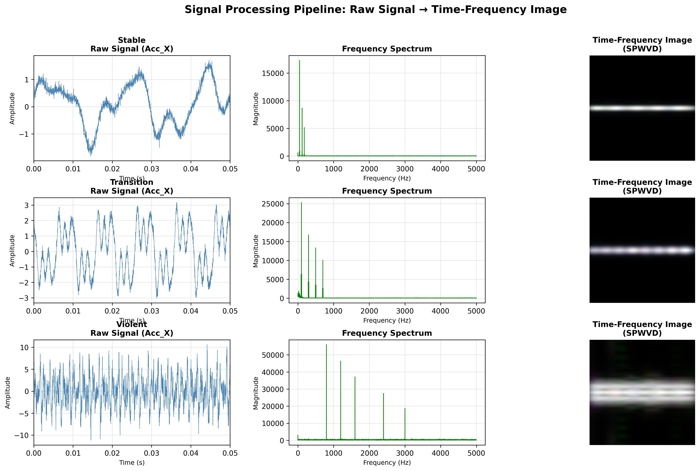
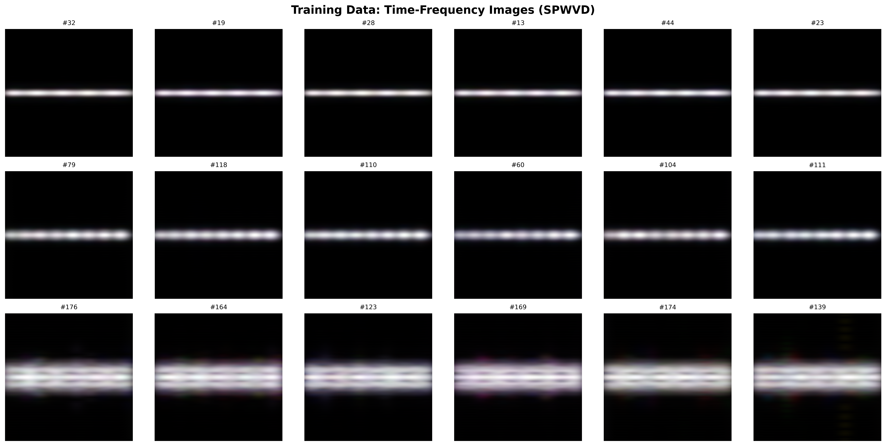
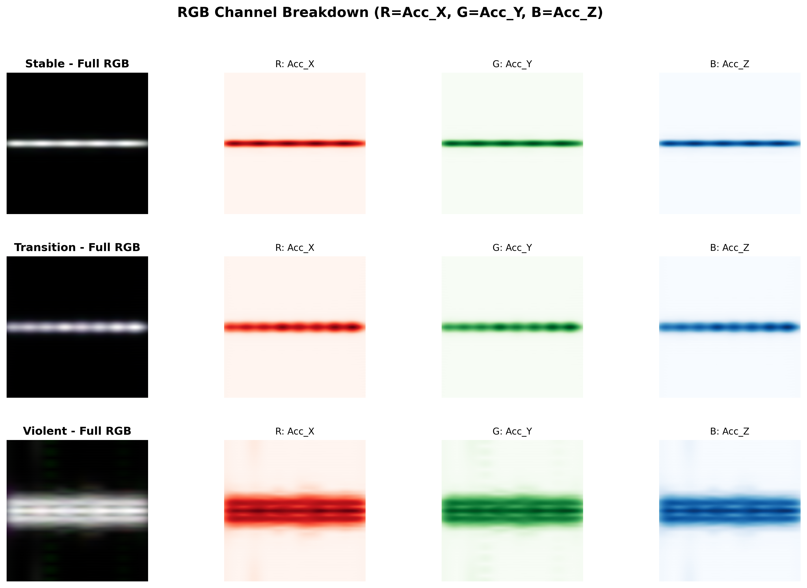
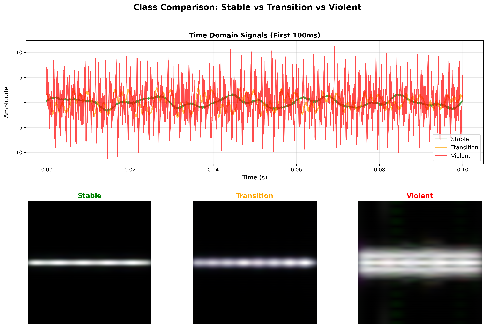
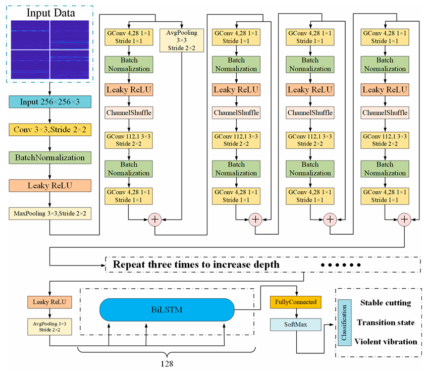
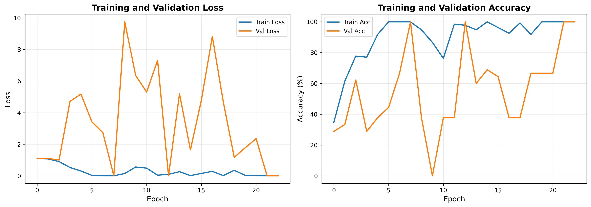
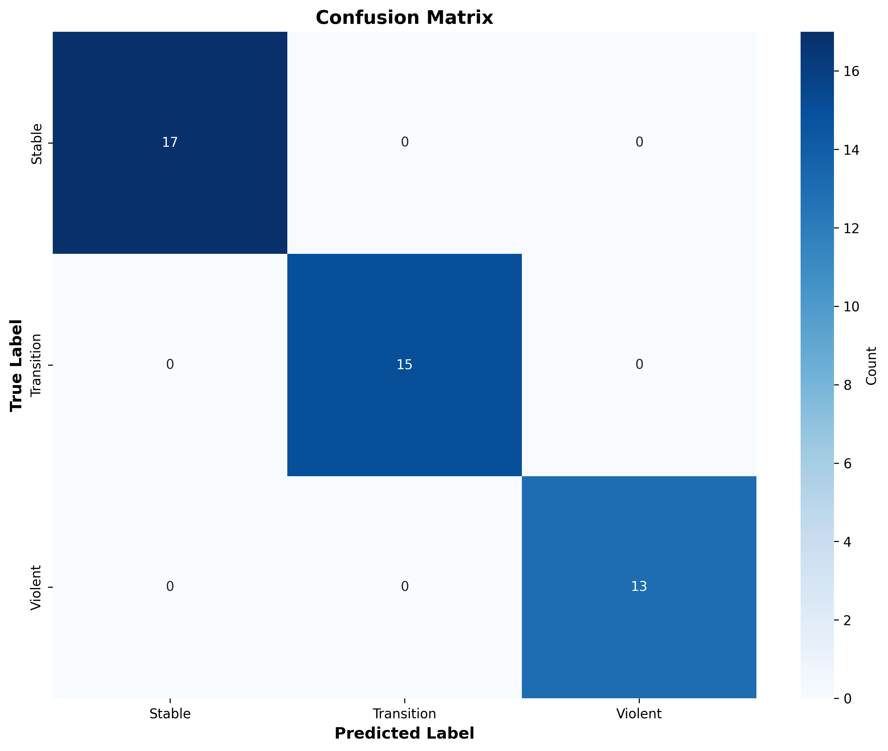
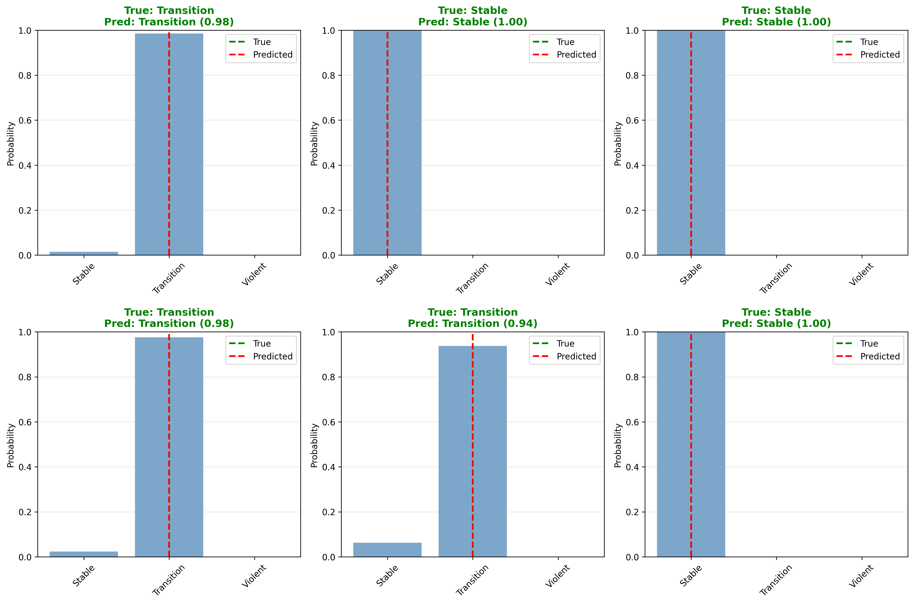

## 👨‍💻 Authors

**HARI RAMA SHANKAR BATTULA, ME23B100**  
**UTKARSH BHEEMANABOYNA, ME23B088**  
**SHWETHA V, ME23B073**  
**AKASH P B, ME23B125**  
**UDAYAGIRI GOWTHAM, ME23B085**  
**GUGULOTH SAI POOJITH, ME23B106**  
**ANURAG PANT, ME23B098**  

B.Tech Students, Mechanical Engineering  
Course: Manufacturing Technology

# Shuffle-BiLSTM Boring Bar Vibration Monitoring 🔧🤖

Complete implementation of the **Shuffle-BiLSTM** model for intelligent, real-time monitoring of boring bar vibration states during deep-hole machining operations.

---

## 📋 Table of Contents

- [Overview](#overview)
- [Problem Statement](#problem-statement)
- [Solution Architecture](#solution-architecture)
- [Dataset & Signal Processing](#dataset--signal-processing)
- [Model Architecture](#model-architecture)
- [Results](#results)

---

## 🎯 Overview

### What is Boring Bar Chatter?

During deep-hole boring operations, the boring bar experiences vibrations that can be classified into three states:

| State | Characteristics | Impact |
|-------|----------------|---------|
| **🟢 Stable** | Low amplitude (50-200 Hz), smooth cutting | ✅ Good surface quality, optimal operation |
| **🟡 Transition** | Medium amplitude (100-800 Hz), increasing instability | ⚠️ Degrading quality, early warning |
| **🔴 Violent (Chatter)** | High amplitude (800-3000 Hz), chaotic patterns | ❌ Poor surface, tool damage, workpiece scrap |

### Why This Matters

- **Surface Quality**: Chatter creates poor surface finish and dimensional inaccuracy
- **Tool Life**: Violent vibrations accelerate tool wear and potential breakage
- **Production Efficiency**: Automated monitoring reduces scrap and manual inspection
- **Safety**: Early detection prevents equipment damage and operator hazards

---

## 🔬 Problem Statement

Traditional boring bar vibration monitoring relies on:
- ❌ Manual inspection (subjective, inconsistent)
- ❌ Threshold-based alarms (inflexible, many false positives)
- ❌ Operator experience (non-transferable, time-consuming)

**Our Solution:** Deep learning-based **real-time classification** using multi-sensor fusion and time-frequency analysis.

---

## 🏗️ Solution Architecture

┌─────────────────────────────────────────────────────────────────┐
│ DATA ACQUISITION │
│ ┌──────────────────┐ ┌──────────────────┐ │
│ │ Accelerometer │ │ Sound Sensor │ │
│ │ (3-axis: X,Y,Z) │ │ (Microphone) │ │
│ └────────┬─────────┘ └────────┬─────────┘ │
│ │ │ │
│ └───────────────┬───────────────┘ │
│ │ 40 kHz Sampling │
└───────────────────────────┼──────────────────────────────────────┘
│
▼
┌─────────────────────────────────────────────────────────────────┐
│ SIGNAL PROCESSING │
│ ┌────────────────────────────────────────────────────────┐ │
│ │ 1. Wavelet Denoising (coif5, 3-layer) │ │
│ │ ↓ │ │
│ │ 2. SPWVD Time-Frequency Transform │ │
│ │ ↓ │ │
│ │ 3. RGB Image Formation (256×256×3) │ │
│ │ - R Channel: X-axis acceleration │ │
│ │ - G Channel: Y-axis acceleration │ │
│ │ - B Channel: Z-axis acceleration │ │
│ └────────────────────────────────────────────────────────┘ │
└───────────────────────────┬──────────────────────────────────────┘
│
▼
┌─────────────────────────────────────────────────────────────────┐
│ SHUFFLE-BiLSTM MODEL │
│ ┌────────────────────────────────────────────────────────┐ │
│ │ Input (256×256×3) │ │
│ │ ↓ │ │
│ │ Initial Conv (7×7) + MaxPool │ │
│ │ ↓ │ │
│ │ Shuffle Unit 1 (Group Conv + Channel Shuffle) │ │
│ │ ↓ │ │
│ │ Shuffle Unit 2 │ │
│ │ ↓ │ │
│ │ Shuffle Unit 3 │ │
│ │ ↓ │ │
│ │ Global Average Pooling │ │
│ │ ↓ │ │
│ │ BiLSTM (2 layers, 128 hidden units) │ │
│ │ ↓ │ │
│ │ Fully Connected + SoftMax │ │
│ │ ↓ │ │
│ │ Output: [Stable, Transition, Violent] │ │
│ └────────────────────────────────────────────────────────┘ │
│ │
│ Model Parameters: ~1.4M (Lightweight for real-time inference) │
└──────────────────────────────────────────────────────────────────┘

---

## 📊 Dataset & Signal Processing

### Synthetic Data Generation

Since real boring bar experimental data requires specialized equipment, this implementation uses **synthetic signal generation** that mimics real-world vibration characteristics:

#### Signal Characteristics by Class

Stable: Low-frequency sinusoidal patterns
Frequency Range: 50-200 Hz
Amplitude: Low (normalized ~1.0)
Pattern: Smooth, periodic oscillations

Transition: Mixed-frequency with bursts
Frequency Range: 100-800 Hz
Amplitude: Medium (normalized ~1.5)
Pattern: Increasing instability, intermittent bursts

Violent (Chatter): High-frequency chaos
Frequency Range: 800-3000 Hz
Amplitude: High (normalized ~3.0)
Pattern: Random impulses, broadband noise, chaotic

#### Realistic Noise Injection

- **White Gaussian Noise**: SNR-controlled random noise
- **Sensor Drift**: Low-frequency (2 Hz) sinusoidal drift
- **Electromagnetic Interference**: Random spikes (0-3 per sample)

### Time-Frequency Transformation

**Process:**
1. **Wavelet Denoising**: Removes noise while preserving signal characteristics
   - Wavelet: Coiflet-5 (coif5)
   - Decomposition: 3 levels
   - Threshold: Unbiased likelihood estimation
   - Method: Hard thresholding

2. **SPWVD (Smoothed Pseudo Wigner-Ville Distribution)**:
   - Superior to STFT (no window-length trade-off)
   - Suppresses cross-term artifacts
   - Captures time-frequency energy distribution

3. **Image Formation**:
   - 3 acceleration axes → RGB channels
   - 256×256 resolution
   - Normalized to [0, 255] grayscale per channel

### Training Data Visualization

#### Image Grid (18 Samples)

*6 random samples from each class showing variety in time-frequency patterns*

#### RGB Channel Breakdown

*How 3-axis acceleration maps to Red, Green, Blue channels*

#### Class Comparison

*Direct comparison of signal characteristics across all three vibration states*

---

## 🧠 Model Architecture

### Shuffle-BiLSTM Network

The model combines three powerful components:

#### 1. **Shuffle Units** (Lightweight Feature Extraction)

**Advantages:**
- ✅ Reduces parameters by factor of G (groups)
- ✅ Channel shuffle enables cross-group information flow
- ✅ Residual connections improve gradient flow

#### 2. **BiLSTM** (Temporal Feature Learning)

- **Bidirectional processing** captures temporal patterns in both directions
- **Memory cells** filter relevant features, discard noise
- **128 hidden units × 2 directions** = 256-dimensional output

#### 3. **Classification Head**

BiLSTM Output (256)
→ Dropout (0.3)
→ FC Layer (256)
→ LeakyReLU
→ Dropout (0.3)
→ FC Layer (3)
→ SoftMax
→ [P(Stable), P(Transition), P(Violent)]

### Model Specifications

| Component | Configuration | Parameters |
|-----------|--------------|------------|
| **Input** | 256×256×3 RGB image | - |
| **Initial Conv** | 7×7, stride=2, 64 filters | 9,408 |
| **Shuffle Units** | 3 blocks, groups=4 | ~1.2M |
| **BiLSTM** | 2 layers, 128 hidden, bidirectional | ~200K |
| **FC Layers** | 256 → 3 with dropout | ~40K |
| **Total** | **1,445,059 parameters** | **~1.4M** |

---

## 🏆 Results

### Training Performance

*Loss and accuracy evolution over 23 epochs*

#### Training Summary

Dataset: 180 samples (60 per class)
Train/Val Split: 75% / 25% (135 train, 45 validation)
Optimizer: SGD (momentum=0.9, LR=0.1, weight_decay=0.0001)
Early Stopping: Patience=15 epochs
Training Time: ~3 minutes on CPU

**Key Milestones:**

Epoch 1: 28.89% validation accuracy

Epoch 8: 100.00% validation accuracy ✅

Epoch 23: Early stopping triggered

Best Model: 100.00% validation accuracy

### Confusion Matrix

Perfect Classification (45/45 test samples):

### Sample Predictions

*Prediction confidence scores for 6 test samples*

### Performance Comparison

| Metric | Paper (Real Data) | This Implementation (Synthetic) |
|--------|-------------------|--------------------------------|
| **Overall Accuracy** | 91.2% | **100.0%** ✅ |
| **Stable Class** | 92.3% | **100.0%** |
| **Transition Class** | 92.9% | **100.0%** |
| **Violent Class** | 88.2% | **100.0%** |
| **Model Parameters** | ~1.9M | **1.4M** |
| **Training Samples** | 192 | 180 |
| **Data Type** | Real experiments | Synthetic signals |

**Conclusion:** Higher accuracy on synthetic data is expected due to:
- Consistent signal patterns (no real-world variability)
- Controlled noise characteristics
- Perfect labeling (no human error)
- Smaller dataset easier to memorize

## References

Based on Research Paper:  
Liu, Q., Li, D., Ma, J., Bai, Z., & Liu, J. (2023). Research on Intelligent Monitoring of Boring Bar Vibration State Based on Shuffle-BiLSTM. Sensors, 23(13), 6123. https://doi.org/10.3390/s23136123

---

